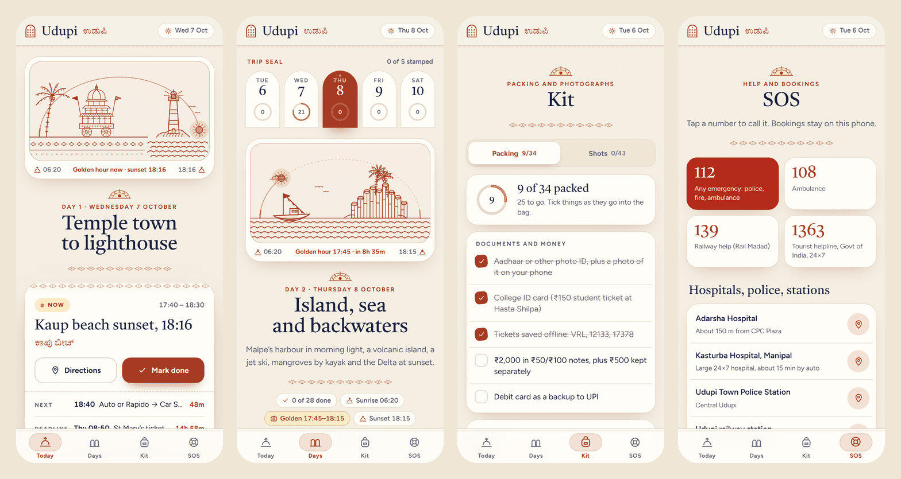

# Udupi · Coast Trip — Kaavi edition

A light, offline-first trip companion for four days on the Udupi coast, 6–10 October 2026: Bagalkot → Udupi by night bus, then three days of island boats, parasailing, kayaking and an optional surf lesson, two evenings out, and only the temples most worth seeing, before the Konkan line and the Ghats take you home. It is drawn in the style of Udupi's **Kaavi** wall art: laterite-red line work on lime-plaster white, with Yakshagana gold and kumkum for highlights.



**Live:** https://udupi-kaavi.vercel.app (unlisted: served with `noindex`, so it stays out of search results)

## What it does

| Screen | What you get |
| --- | --- |
| **Today** | The day's mural with the real sun moving along its arc, a **Now** card with directions and a one-tap *Mark done*, the next stop and the next hard deadline with countdowns, a marigold garland of progress, and the timeline (earlier stops fold away). Stops with photos carry a folded **Where to shoot** guide: for each shot, where to stand, how to frame it and, where the light matters, when. It opens by itself at the stop you are at. |
| **Days** | Five arched day tiles that take a rubber-stamp seal when every stop on that day is done, sun and golden-hour times, the weather note, Plan A / Plan B where it matters, and *If plans change* for each day. |
| **Kit** | The packing list, with your own items. |
| **SOS** | Tap-to-call emergency numbers, hospitals and stations with directions, your bookings (kept on the phone), both train timetables, the rules that protect the trip, auto fares, a plan-versus-paid money card, and backup to a file. |

Every stop opens a sheet with its story, its Kannada name, opening hours, tips, where to shoot, what you paid, and *Directions*, *Edit* and *Skip*. You can add your own stops on any day. A one-line journal with a mood closes each day.

## Design

- **Palette:** lime plaster `#F6F1E7`, laterite `#A63A22`, Yakshagana gold `#E2A72E`, kumkum `#B52B19`, areca green, Arabian Sea teal. Light theme only, with text contrast checked against WCAG AA.
- **Type:** [Tiro Kannada](https://fonts.google.com/specimen/Tiro+Kannada) for headings and every Kannada name, [Figtree](https://fonts.google.com/specimen/Figtree) for the interface.
- **Motifs:** the Kanakana Kindi window as the emblem, Mangalore-tile eaves under the header, a Yakshagana crown over each heading, and five hand-built SVG murals: the Bagalkot night bus, Udupi's chariot and the Kaup lighthouse, St Mary's basalt columns, the Konkan train over the valley, and Bagalkot station.
- **Motion:** the Kindi lights up and opens like temple doors, murals draw themselves in while the sun eases to the current time, screens slide between tabs (View Transitions), sheets spring up, ticked stops burst into marigold petals, and finished days are stamped. Everything respects *reduce motion*.

## Project layout

```
public/                  the whole site, served as-is (no build step)
  index.html
  sw.js                  offline cache: app shell plus Google Fonts
  manifest.webmanifest
  css/                   base · components · pieces · screens · motion
  js/                    art · core · pieces · screens · sheets · app
  data/                  trip.js (reference data) and one file per day
  icons/
tests/                   Playwright tests and a local server that mirrors vercel.json
docs/                    screenshots for this README
vercel.json              security headers (CSP, noindex) and the output directory
```

The scripts are plain classic scripts loaded in order and sharing one global scope: trip data → `art.js` (the Kaavi drawings) → `core.js` (time, state, plan) → `pieces.js` → `screens.js` → `sheets.js` → `app.js` (events and start-up). All times are computed in IST, whatever the phone's time zone.

## Run it locally

```bash
node tests/server.mjs          # http://127.0.0.1:4173
```

Add `?t=2026-10-07T09:50` to the address to see the app at any moment of the trip.

## Tests

```bash
cd tests
npm ci
npx playwright install chromium
npx playwright test
```

28 browser tests on a phone-sized Chromium cover ticking, sheets, skipping, editing and adding stops, Plan B on Thursday and Friday, the night-out stops, the shot guide, days, kit, bookings, backup and restore, reset, the journal, day stamps, loading data saved by the previous version, the intro, security headers, the install manifest, offline use, and layout at 320, 390 and 820 px with no console errors or CSP violations. GitHub Actions runs them on every push to `main`.

## Editing the trip

Each day lives in `public/data/day-*.js`. A stop looks like this:

```js
{id:`we7`, t:`07:15`, k:`temple`, x:`Sri Krishna Matha, dawn darshan`, kn:`ಶ್ರೀ ಕೃಷ್ಣ ಮಠ`,
 q:`Udupi Sri Krishna Matha`, m:`w`, dur:35, win:`Darshan from 05:00`, b:`…`, tips:[`…`], sh:[`…`]}
```

| Field | Meaning |
| --- | --- |
| `id` | Stable id. Ticks, skips and edits are saved against it, so never reuse or renumber ids. |
| `t`, `dur` | Start time (24 h, IST) and minutes. |
| `k` | Kind: `temple`, `culture`, `coast`, `nature`, `adventure`, `photo`, `boat`, `food`, `night`, `move`, `bus`, `train`, `rest`, `prep`, `stop`. |
| `x`, `kn` | Title and Kannada name. |
| `q`, `m` | Google Maps query, and `m:'w'` for walking directions. |
| `c` | Cost range in rupees, `[low, high]`. |
| `win`, `b`, `tips` | Opening hours, body text and tips. |
| `sh` | Shots, each `{x, at, fr, tm}`: what to shoot, where to stand, how to frame it and, optionally, the best time. Ticks are saved by position, so add new shots at the end. |
| `hard`, `fix`, `star`, `info` | Hard deadline, fixed time, highlight, passing information with no tick. |
| `v` | `A` or `B` for stops that belong to one plan on days with a Plan B. |

## Releasing a change

1. Make the change and run the tests.
2. Bump the version in **both** `public/js/core.js` (`APP_V`) and `public/sw.js` (`V`). They must match.
3. Push to `main`. Vercel deploys it, and phones with the app open see *A fresh version of the app is ready*.

## Privacy

There are no accounts, analytics or servers. Ticks, notes, bookings and amounts paid stay in the browser's `localStorage` under `udupi.app.v1`, and *Backup* writes them to a file only you keep. The site sends `noindex`, a strict Content-Security-Policy and `no-referrer`.

## Credits

Fonts: Tiro Kannada by Tiro Typeworks and Figtree by Erik Kennedy, both from Google Fonts under the SIL Open Font License. The illustrations are drawn in SVG for this project, after the Kaavi art of the Konkan coast and Udupi's temple and Yakshagana traditions.
